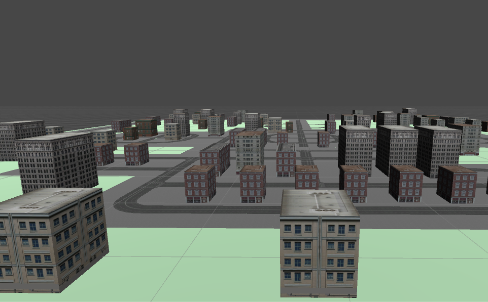

# Alerta Minerva

This game is about Monster Balls trying to destroy “Guanatos City”.
Your mission is to defend the city from these horrible muted creatures who want to destroy our city looking for revenge, since they were created by a mutation originated by the radioactive waves generated by the city.

The game was created for the Global Game Jam 2017.

## How to Install

Just unzip the file and click the ``AlertaMinverva.exe`` file.

## How to play

To play just click on "Jugar".

The objetive of the game is to repel the monsters ball from your city. To repel them, just click the "Towers" to generate a "Wave".
It will repel the monsters ball and damage them. Try to survive the longest time you can!

The game is over when the Towers or your City Buldings are gone.

## Screens

